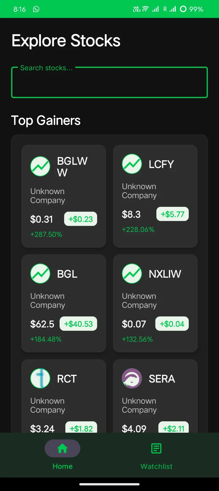
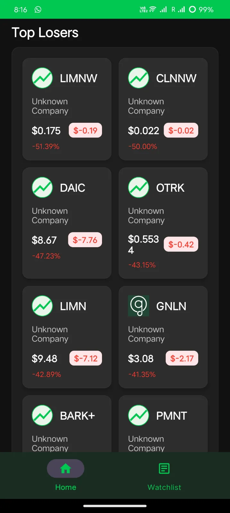
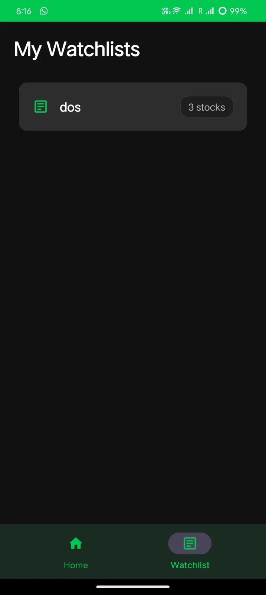
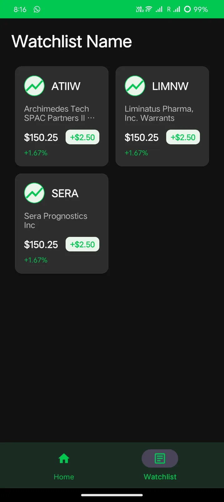

#Grow Internship App
## 🚀 Features


- ALERT : I have directly added api keys (free ) which has 25 request per day. ( I know its not recommended for production usecase, its just done for testing and assignment purpose )

### 📊 **Explore Screen**
- **Top Gainers & Losers**: Real-time display of stocks with highest gains and losses
- **Stock Search**: Search for stocks by company name or ticker symbol
- **Stock Cards**: Display key information including price, change percentage, and market cap

### 📈 **Product Detail Screen**
- **Real-time Stock Data**: Current price, change, and percentage change
- **Company Overview**: Detailed company information and financial metrics
- **Interactive Charts**: 
  - Intraday chart (15-minute intervals)
  - Daily adjusted chart for historical trends
- **Add to Watchlist**: Quick action to add stocks to custom watchlists

### 📋 **Watchlist Management**
- **Multiple Watchlists**: Create and manage multiple watchlists
- **Watchlist Details**: View all stocks in a specific watchlist
- **Stock Management**: Add/remove stocks from watchlists
- **Real-time Updates**: Live price updates for watchlist stocks

## 🛠️ Tech Stack

- **Language**: Kotlin
- **Architecture**: MVVM (Model-View-ViewModel)
- **UI Framework**: Android XML layouts
- **Dependency Injection**: Hilt
- **Networking**: Retrofit + OkHttp
- **Database**: Room (SQLite)
- **Navigation**: Navigation Component
- **Charts**: MPAndroidChart
- **Image Loading**: Coil
- **Coroutines**: Kotlin Coroutines for async operations

## 📱 Screenshots
## 📱 Screenshots

### App Preview

<div align="center">
  
  
  
  
</div>


### Home/Explore Screen
- Top gainers and losers display
- Stock search functionality
- Stock cards with key metrics

### Product Detail Screen
- Real-time stock data
- Interactive price charts
- Company overview information
- Add to watchlist functionality

### Watchlist Screens
- Multiple watchlist management
- Watchlist detail view
- Stock addition/removal dialogs

## 🔌 API Endpoints

The app integrates with **Alpha Vantage API** using the following endpoints:

### 1. **Ticker Search**
```
GET /query?function=SYMBOL_SEARCH&keywords={keywords}&apikey={apiKey}
```
- Search for stocks by company name or ticker symbol

### 2. **Company Overview**
```
GET /query?function=OVERVIEW&symbol={symbol}&apikey={apiKey}
```
- Get detailed company information and financial metrics

### 3. **Real-Time Quote**
```
GET /query?function=GLOBAL_QUOTE&symbol={symbol}&apikey={apiKey}
```
- Get current stock price and change data

### 4. **Intraday Time Series**
```
GET /query?function=TIME_SERIES_INTRADAY&symbol={symbol}&interval=15min&outputsize=compact&apikey={apiKey}
```
- Get 15-minute interval data for short-term charts

### 5. **Daily Time Series Adjusted**
```
GET /query?function=TIME_SERIES_DAILY_ADJUSTED&symbol={symbol}&outputsize=compact&apikey={apiKey}
```
- Get daily adjusted data for historical charts

### 6. **Top Gainers and Losers**
```
GET /query?function=TOP_GAINERS_LOSERS&apikey={apiKey}
```
- Get list of top gaining and losing stocks

## 🏗️ Project Structure

```
app/src/main/java/com/divyansh/growassignment/
├── data/
│   ├── api/           # API interfaces and network layer
│   ├── dao/           # Room database access objects
│   ├── local/         # Database configuration
│   ├── mappers/       # Data transformation utilities
│   ├── models/        # Data models and entities
│   └── repository/    # Repository pattern implementation
├── di/                # Dependency injection modules
├── presentation/      # UI layer
│   ├── explore/       # Explore screen components
│   ├── product/       # Product detail screen components
│   └── watchlist/     # Watchlist management components
├── usecase/           # Business logic use cases
└── util/              # Utility classes
```


## 📦 Dependencies

### Core Dependencies
- **AndroidX Core KTX**: Kotlin extensions
- **Material Design**: UI components
- **ConstraintLayout**: Layout management

### Networking
- **Retrofit**: HTTP client
- **OkHttp**: HTTP logging
- **Gson**: JSON parsing

### Architecture
- **Hilt**: Dependency injection
- **ViewModel & LiveData**: MVVM architecture
- **Room**: Local database
- **Navigation Component**: Screen navigation

### UI & Charts
- **MPAndroidChart**: Interactive charts
- **Coil**: Image loading
- **Bottom Navigation**: Navigation UI


